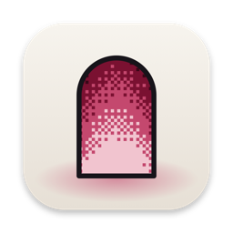
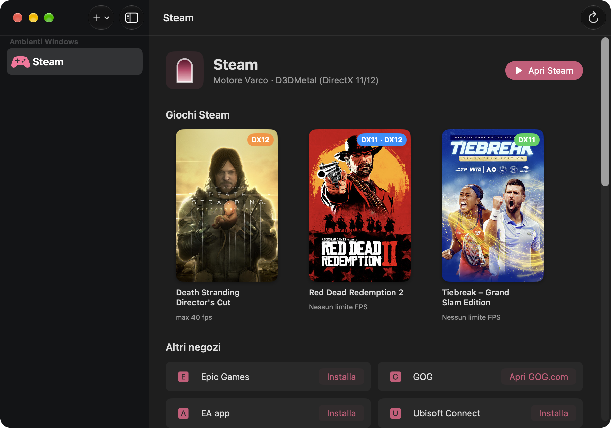

<h1 align="center">Varco</h1>

<b>Giochi Windows sul tuo Mac. Il varco è aperto.</b> 
Un'app gratuita e open source per giocare la tua libreria Steam sui Mac con Apple Silicon.

<a href="README.md">English</a>

## Cosa fa

- **La tua libreria Steam, su macOS.** Installi Steam una volta: ogni gioco che scarichi compare in Varco da solo,
  con copertina, versione DirectX e avanzamento del download.
- **DirectX 11 e 12** con D3DMetal di Apple, **DirectX 9–11** con Wine.
- **Modalità Gioco di macOS**: ogni gioco gira come un'app Mac a sé della categoria "giochi", così macOS
  attiva la Modalità Gioco: il gioco ha la priorità su CPU e GPU, negozi, launcher e browser passano in secondo piano
  e i controller Bluetooth rispondono più in fretta.
- **Limite FPS per ogni gioco**: usa l'impostazione del gioco quando c'è, altrimenti il limitatore di Varco
  (integrato nel motore). Di base è spento; puoi anche impostare un limite unico per tutti i giochi, anche quelli futuri.
- **Risparmio batteria**: a batteria ogni gioco è limitato a 60 FPS (o 30/40), e il limite si attiva e si toglie da
  solo quando stacchi o ricolleghi l'alimentatore, anche a gioco aperto. Si può disattivare nelle impostazioni.
- **Altri negozi**: Epic Games, EA app, Ubisoft Connect e Battle.net si installano con un clic dai loro siti
  ufficiali, per i giochi comprati lì e per i giochi Steam che ne richiedono uno. GOG Galaxy non funziona ancora: i
  giochi GOG si installano con gli installer offline dal sito di GOG.
- **DualSense e controller Xbox**: ogni gioco può vedere il DualSense come controller PlayStation o Xbox.
- **Finestre nitide e a grandezza normale**: risoluzione Retina con l'interfaccia di Windows al 200% (regolabile per
  bottle).
- **Tastiera**: a scelta, ⌘ come Ctrl e ⌥ come Alt, per i giochi con scorciatoie da tastiera.
- **Giochi su SSD esterni**: i dischi delle librerie vengono ricordati e ricollegati da soli.
- **Installazione guidata**: installa Rosetta, il motore, D3DMetal e Steam al posto tuo, e propone gli aggiornamenti
  del motore.
- **Segnala un problema** copia i dati del Mac, del motore e dell'ambiente (senza il tuo nome utente) per una
  segnalazione su GitHub.
- Interfaccia in italiano e in inglese.

## Requisiti

- Un Mac con Apple Silicon (M1 o successivi) e macOS 15 Sequoia o successivi.
- Circa 2 GB liberi, più lo spazio dei giochi.
- Rosetta 2 (la installa l'installazione guidata). Il motore di Varco è Wine per Intel (x86_64).

## Installazione

1. Scarica `Varco.zip` dalla pagina [Releases](https://github.com/VellBlue/varco/releases) e sposta `Varco.app`
   in Applicazioni.
2. Aprila: l'installazione guidata installa tutto quello che manca, passo per passo.
3. Clicca **Crea e installa Steam**, accedi, scarica un gioco e premi **Gioca**.

> Le versioni pubblicate non sono ancora notarizzate da Apple, quindi la prima volta macOS blocca Varco. Apri
> **Impostazioni di Sistema → Privacy e sicurezza**, scorri in fondo e clicca **Apri comunque** accanto a Varco
> (serve una volta sola).

Varco controlla su GitHub una volta al giorno se c'è una versione nuova, e in quel caso mostra un pulsante (si può
disattivare in Varco → Impostazioni). Non raccoglie nessun dato.

## Come funziona

Varco è un'app SwiftUI nativa sopra un motore Wine compilato dai sorgenti che CodeWeavers pubblica per
CrossOver 26.3, con alcune modifiche proprie (`engine/patches/`):

| Patch | Cosa fa |
|---|---|
| `01-d3dmetal-per-process` | I giochi usano D3DMetal; Steam e i launcher con browser integrato usano la grafica di Wine |
| `02-browser-arguments` | Aggiunge le opzioni che fanno funzionare le interfacce di Steam e degli altri launcher sotto Wine |
| `03-fps-limiter` | Limitatore di fotogrammi per gioco, per tutti i giochi D3DMetal |
| `04-child-windows-over-opengl` | Mostra le sottofinestre (per esempio il browser della pagina di accesso dell'EA app) sopra le finestre disegnate con OpenGL/Metal, come su Windows (solo per l'EA app) |
| `05-optional-unwind-outputs` | Accetta puntatori di uscita vuoti nel riavvolgimento dello stack, come Windows (evita un crash all'avvio) |
| `06-app-bundles-game-mode` | Avvia ogni programma da un suo piccolo pacchetto app dichiarato come gioco (negozi e launcher come strumenti), così macOS può attivare la Modalità Gioco |
| `07-battery-fps-limit` | Applica un limite FPS più basso quando il Mac va a batteria, seguendo l'alimentazione mentre cambia |
| `08-metalfx-boost` | Sperimentale, spento di default (`VARCO_BOOST=1`): quando un gioco disegna sotto la risoluzione della sua finestra, ingrandisce l'immagine con MetalFX invece del ridimensionamento sfocato di macOS |

Il resto è nel comando `varco` (`cli/varco`), che l'app usa per ogni operazione.

## Compatibilità

La maggior parte dei giochi DirectX 9–12 senza anti-cheat a livello di sistema può funzionare. I giochi con
anti-cheat che non supportano Wine (per esempio alcuni multiplayer competitivi) non partono. La compatibilità
varia da gioco a gioco: se ne provi uno, una [segnalazione](https://github.com/VellBlue/varco/issues/new/choose)
aiuta tutti.

## Compilare dai sorgenti

Vedi [docs/BUILDING.md](docs/BUILDING.md).

## Note legali

- Il codice di Varco è distribuito con [licenza MIT](LICENSE). Il motore Wine e le patch di Varco sono LGPL 2.1+.
- **D3DMetal è di Apple.** È distribuito a parte, senza modifiche, con la licenza Apple, che ne consente la
  distribuzione **solo per scopi non commerciali**. In alternativa puoi installarlo dalla tua copia del
  [Game Porting Toolkit](https://developer.apple.com/games/game-porting-toolkit/).
- Varco non è affiliato né approvato da CodeWeavers, Apple, Valve o dal progetto Wine. CrossOver è un marchio di
  CodeWeavers; Steam è un marchio di Valve. Vedi [docs/THIRD_PARTY_NOTICES.md](docs/THIRD_PARTY_NOTICES.md).
- Sostieni il progetto che rende possibile tutto questo: [Wine](https://www.winehq.org).
