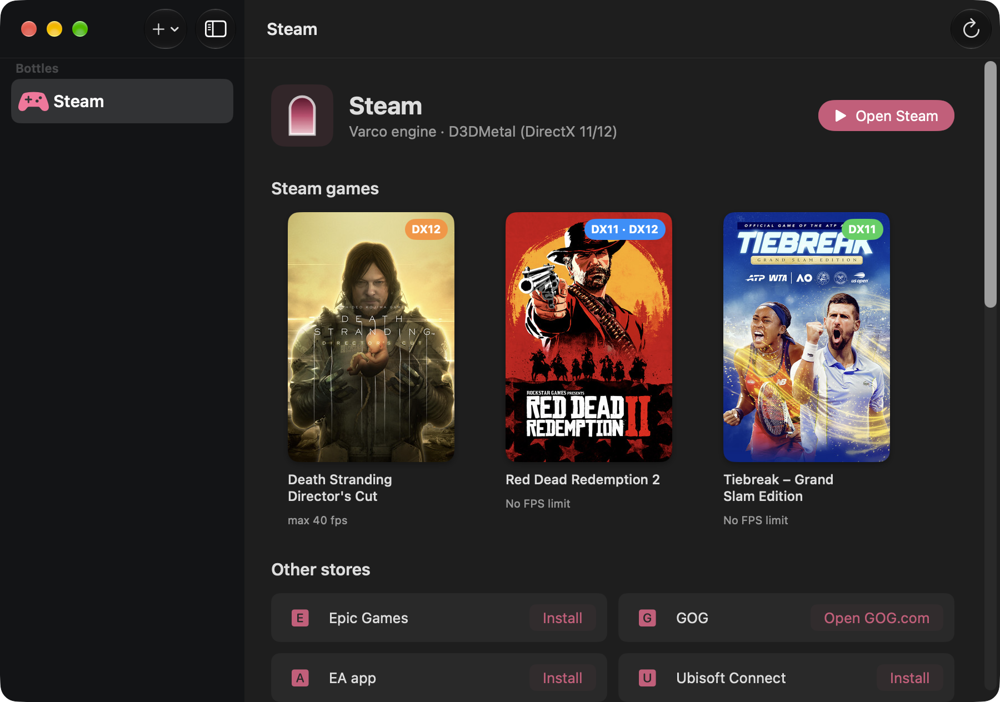

<h1 align="center">Varco</h1>

<b>Windows games on your Mac. The way is open.</b> 
A free, open-source app to play your Steam library on Apple Silicon Macs.

<a href="README.it.md">Italiano</a>

## What it does

- **Your Steam library, on macOS.** Install Steam once: every game you download shows up in Varco by itself,
  with its cover, DirectX version and download progress.
- **DirectX 11 and 12** through Apple's D3DMetal, **DirectX 9–11** through Wine.
- **macOS Game Mode**: every game runs as its own Mac app of the "games" category, so macOS turns on
  Game Mode for it: the game gets priority on the CPU and GPU, while stores, launchers and browsers wait behind it,
  and Bluetooth controllers respond faster.
- **Per-game FPS limit**: uses the game's own setting when it has one, otherwise Varco's frame limiter
  (built into the engine). Off by default; you can also set one limit for every game, including future downloads.
- **Varco Boost**: up to ~45% more FPS in games limited by the GPU. Turn it on in the bottle's settings and choose
  fullscreen at a lower resolution in the game (Red Dead Redemption 2 is set up automatically): the Mac's display
  doesn't change and MetalFX enlarges the image to the screen's full resolution.
- **Battery saver**: on battery, every game is limited to 60 FPS (or 30/40), switching on and off by itself when you
  unplug or plug in the power adapter, even mid-game. It can be turned off in the settings.
- **Other stores**: Epic Games, the EA app, Ubisoft Connect and Battle.net install with one click from their official
  websites — for games bought there, and for Steam games that require one of them. GOG Galaxy doesn't work yet:
  install GOG games with the offline installers from the GOG website.
- **DualSense and Xbox controllers**: each game can see the DualSense as a PlayStation or an Xbox controller.
- **Sharp, normal-size windows**: Retina resolution with the Windows interface at 200% (adjustable per bottle).
- **Keyboard**: optionally use ⌘ as Ctrl and ⌥ as Alt, for games with keyboard shortcuts.
- **Games on external SSDs**: library drives are remembered and reconnected automatically.
- **Setup assistant**: installs Rosetta, the engine, D3DMetal and Steam for you, and offers engine updates.
- **Report a problem** copies your Mac, engine and bottle details (without your user name) for a GitHub issue.
- Italian and English interface.

## Requirements

- A Mac with Apple Silicon (M1 or later) and macOS 15 Sequoia or later.
- About 2 GB of free space, plus your games.
- Rosetta 2 (the setup assistant installs it). Varco's engine is an Intel (x86_64) build of Wine.

## Install

1. Download `Varco.zip` from the [Releases](https://github.com/VellBlue/varco/releases) page and move
   `Varco.app` to Applications.
2. Open it: the setup assistant installs everything that's missing, step by step.
3. Click **Create and install Steam**, sign in, download a game and press **Play**.

> Releases are not notarized by Apple yet, so the first time macOS blocks Varco. Open **System Settings → Privacy &
> Security**, scroll down and click **Open Anyway** next to Varco (only needed once).

Varco checks GitHub for a new version once a day and shows a button when there is one (you can turn this off in
Varco → Settings). It doesn't collect any data.

## How it works

Varco is a native SwiftUI app on top of a Wine engine built from the source code that CodeWeavers publishes for
CrossOver 26.3, with a few patches of its own (`engine/patches/`):

| Patch | What it does |
|---|---|
| `01-d3dmetal-per-process` | Games use D3DMetal; Steam and launchers with an embedded browser use Wine's own renderer |
| `02-browser-arguments` | Adds the browser options that make the UIs of Steam and the other launchers render under Wine |
| `03-fps-limiter` | Per-game frame limiter for every D3DMetal game |
| `04-child-windows-over-opengl` | Shows child windows (for example the browser with the EA app's sign-in page) above windows drawn with OpenGL/Metal, as on Windows (EA app only) |
| `05-optional-unwind-outputs` | Lets games pass empty output pointers to the stack unwinder, as Windows does (prevents a crash at startup) |
| `06-app-bundles-game-mode` | Runs each program from its own small app bundle, declared as a game (stores and launchers as tools), so macOS can turn on Game Mode |
| `07-battery-fps-limit` | Applies a lower FPS limit while the Mac runs on battery, following the power source as it changes |
| `08-metalfx-boost` | Varco Boost: a game in fullscreen at a lower resolution renders at that size (the Mac's display never changes) and is enlarged to the screen with MetalFX; its window is shown at the screen's corner even when D3DMetal places it off-center |
| `09-msync-warn-once` | Warns once when msync's wait-list pool runs out, instead of at every allocation: some games (Tiebreak) wrote millions of lines and fell from ~86 to ~30 fps |

Everything else lives in the `varco` command-line tool (`cli/varco`), which the app calls.

## Compatibility

Most DirectX 9–12 games without kernel-level anti-cheat can run. Games with anti-cheat systems that don't support
Wine (for example some competitive multiplayer games) won't start. Compatibility varies from game to game: if you
try one, a [game report](https://github.com/VellBlue/varco/issues/new/choose) helps everyone.

## Building from source

See [docs/BUILDING.md](docs/BUILDING.md).

## Legal

- Varco's code is released under the [MIT license](LICENSE). The Wine engine and the Varco patches are LGPL 2.1+.
- **D3DMetal belongs to Apple.** It is distributed separately, unmodified, with Apple's license, which allows
  **non-commercial** distribution only. You can also install it from your own copy of the
  [Game Porting Toolkit](https://developer.apple.com/games/game-porting-toolkit/).
- Varco is not affiliated with or endorsed by CodeWeavers, Apple, Valve or the Wine project. CrossOver is a
  trademark of CodeWeavers; Steam is a trademark of Valve. See [docs/THIRD_PARTY_NOTICES.md](docs/THIRD_PARTY_NOTICES.md).
- Please support the project that makes this possible: [Wine](https://www.winehq.org).
